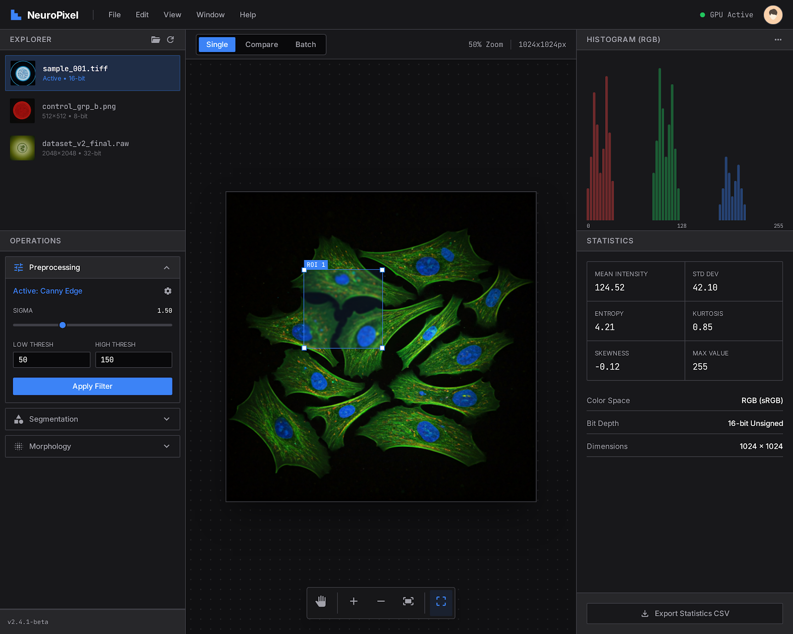
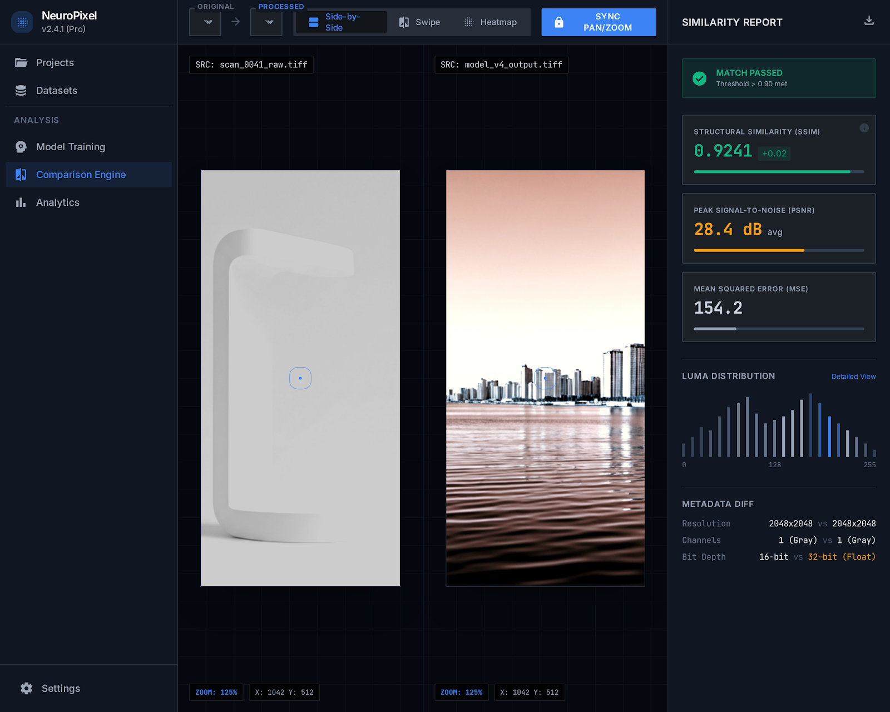

# LumaGraph

**High-performance, local-first Scientific Image Analysis Workstation.**

LumaGraph allows Computer Vision Engineers to visualize, process, and compare high-resolution images using advanced algorithms in a hybrid desktop/web environment.

## Key Features

*   **Analysis Workspace:** Single image analysis with real-time histograms, statistics (Mean, Std Dev, Entropy), and pixel inspection.
*   **Comparison Engine:** Compare two images side-by-side or using overlay modes, with automatic calculation of SSIM, PSNR, and MSE metrics.
*   **Pipeline Editor:** Visual node-based editor for creating complex image processing workflows with Markdown Notes support.
*   **Batch Processing:** Apply processing pipelines to large sets of images efficiently.
*   **Keyboard Shortcuts:** Comprehensive keyboard control support (Press `?` or access via Help > Keyboard Shortcuts).
*   **Plugin System:** Extensible Python-based architecture. Includes standard library plugins:
    *   Brightness/Contrast/Exposure/Saturation/Temperature/HSL Adjust
    *   Shadows/Highlights, Denoise, Sharpen, Unsharp Mask
    *   Canny Edge Detection, Laplacian, Gaussian Blur
    *   Morphology operations, Thresholding (Otsu)
    *   Geometry (Rotate, Flip, Crop, Resize)

## Screenshots

### Analysis Workspace


### Comparison Engine


### Pipeline Editor


## Tech Stack

**Frontend (Web/Desktop UI):**
*   **React 18** + **TypeScript** + **Vite**
*   **TailwindCSS** + **shadcn/ui**
*   **Zustand** (State Management)
*   **@xyflow/react** (Node Editor)

**Backend (Core Logic):**
*   **Python 3.11**
*   **FastAPI** (Async API)
*   **OpenCV** + **NumPy** + **Scikit-Image**
*   **Poetry** (Dependency Management)

**Desktop Runtime:**
*   **Tauri v2** (Rust) - Provides native OS integration and sidecar management.

## Getting Started

### Prerequisites
*   Node.js (pnpm required)
*   Python 3.11+ (Poetry required)
*   Rust (for Desktop build)

### Development

1.  **Frontend:**
    ```bash
    cd apps/web-client
    pnpm install
    pnpm dev
    ```

2.  **Backend:**
    ```bash
    cd apps/backend
    poetry install
    poetry run python -m app.main
    ```

3.  **Desktop (Tauri):**
    ```bash
    cd apps/desktop
    pnpm tauri dev
    ```

### Docker
You can also run the web version using Docker Compose:
```bash
docker-compose up --build
```

## Security
Recent updates include hardening against:
*   Path Traversal attacks (UUID-based storage).
*   Insecure File Uploads (Magic number MIME type verification).
*   CORS configuration for strict origin control.

## ⚠️ Known Issues
*   **Build Configuration:** The `apps/desktop/src-tauri/tauri.conf.json` file defines `npm` commands for build processes, which conflicts with the project's strict `pnpm` requirement.
